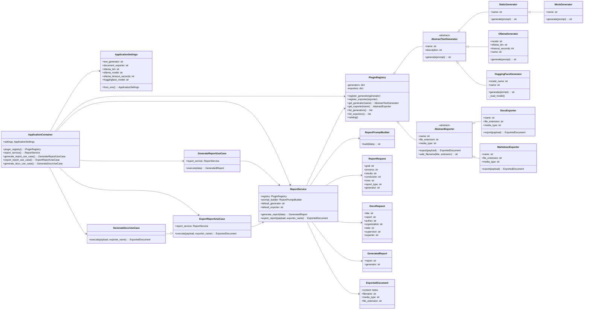

# Диаграмма классов

Диаграмма отражает реализацию после доработки по ipynb: генераторы и экспортёры оформлены как плагины, а зависимости передаются через контейнер.

## Что показывает диаграмма

Диаграмма показывает, какие классы участвуют в генерации и экспорте отчётов. Главная идея: `ReportService` не зависит напрямую от конкретной LLM или конкретного формата файла. Он работает с абстракциями `AbstractTextGenerator` и `AbstractExporter`, а конкретную реализацию получает через `PluginRegistry`.

## Что означает каждый класс

| Класс | За что отвечает |
|---|---|
| `ReportRequest` | DTO входных данных для генерации отчёта. Хранит цель, ход работы, результаты, вывод, тон и выбранный генератор. |
| `GeneratedReport` | DTO результата генерации. Содержит готовый текст отчёта и имя использованного генератора. |
| `DocxRequest` | DTO входных данных для экспорта. Содержит заголовок, текст отчёта, автора, организацию, дату, руководителя и выбранный экспортёр. |
| `ExportedDocument` | DTO результата экспорта. Хранит байты файла, имя файла, MIME-тип и расширение. |
| `AbstractTextGenerator` | Абстрактный интерфейс для всех генераторов текста. Требует метод `generate(prompt)`. |
| `StaticGenerator` | Простой детерминированный генератор. Нужен для проверки backend без Ollama. |
| `MockGenerator` | Заглушка для демонстрации и unit-тестирования. Наследуется от `StaticGenerator`. |
| `OllamaGenerator` | Генератор через локальную Ollama. Хранит модель, путь к команде Ollama и timeout. |
| `HuggingFaceGenerator` | Опциональный генератор через HuggingFace. Загружает модель лениво, только при использовании. |
| `AbstractExporter` | Абстрактный интерфейс для всех экспортёров документов. Требует `export(payload)`. |
| `DocxExporter` | Экспортирует отчёт в Microsoft Word `.docx`. |
| `MarkdownExporter` | Экспортирует отчёт в Markdown `.md`. |
| `PluginRegistry` | Реестр плагинов. Регистрирует генераторы/экспортёры и возвращает нужный плагин по имени. |
| `ReportPromptBuilder` | Строит промпт для LLM из локальных данных пользователя. |
| `ReportService` | Главный сервис приложения. Оркестрирует генерацию и экспорт через реестр плагинов. |
| `GenerateReportUseCase` | Use case генерации текста отчёта. Делегирует работу `ReportService`. |
| `ExportReportUseCase` | Общий use case экспорта отчёта в выбранный формат. |
| `GenerateDocxUseCase` | Совместимый use case для DOCX. По умолчанию вызывает экспортёр `docx`. |
| `ApplicationSettings` | Читает настройки из окружения: генератор, экспортёр, модель Ollama, timeout, HuggingFace-модель. |
| `ApplicationContainer` | Dependency Injection container. Создаёт и связывает настройки, реестр, сервисы и use cases. |

## Как объяснить связи между классами

| Связь | Объяснение |
|---|---|
| `AbstractTextGenerator <|-- ...` | Конкретные генераторы наследуются от общего интерфейса. Поэтому их можно взаимозаменять. |
| `AbstractExporter <|-- ...` | Конкретные экспортёры наследуются от общего интерфейса. Поэтому можно добавлять новые форматы файлов. |
| `PluginRegistry o-- AbstractTextGenerator` | Реестр хранит набор зарегистрированных генераторов. |
| `PluginRegistry o-- AbstractExporter` | Реестр хранит набор зарегистрированных экспортёров. |
| `ReportService --> PluginRegistry` | Сервис не создаёт плагины сам, а получает их из реестра. |
| `ReportService --> ReportPromptBuilder` | Сервис использует отдельный класс для сборки промпта. |
| `GenerateReportUseCase --> ReportService` | Use case запускает бизнес-сценарий генерации через сервис. |
| `ExportReportUseCase --> ReportService` | Use case запускает бизнес-сценарий экспорта через сервис. |
| `ApplicationContainer --> ...` | Контейнер создаёт зависимости и передаёт их туда, где они нужны. |

## Если кратко

Можно сказать так:

> Мы выделили общие абстракции для генераторов текста и экспортёров документов. Благодаря этому backend не зависит от конкретной реализации Ollama или DOCX. `ReportService` работает с интерфейсами, `PluginRegistry` хранит реализации, а `ApplicationContainer` собирает зависимости. Поэтому систему можно расширять новыми генераторами и форматами экспорта без переписывания основной бизнес-логики.
