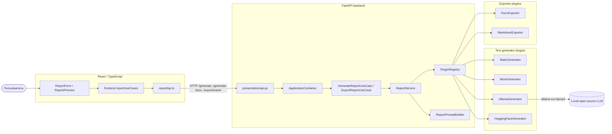
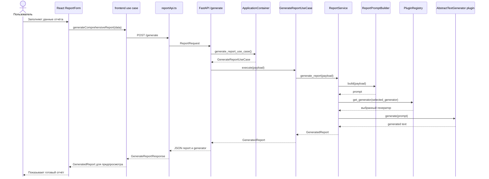
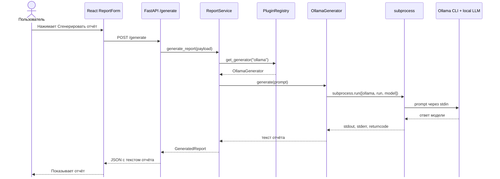
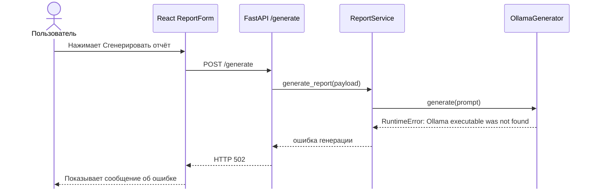
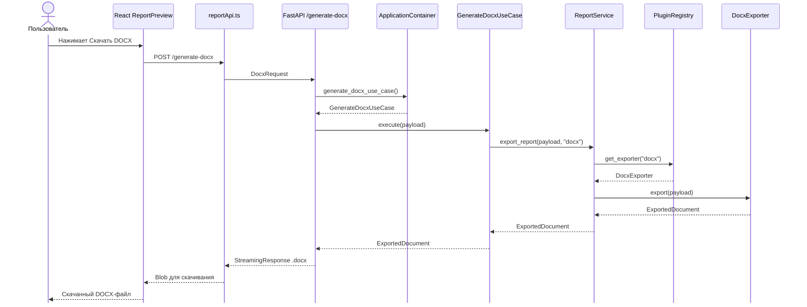
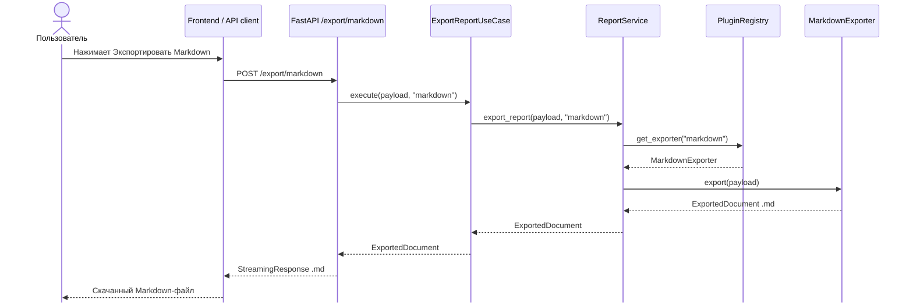
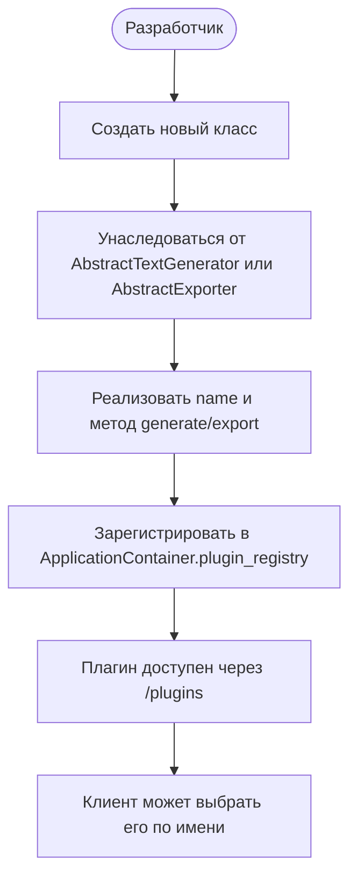
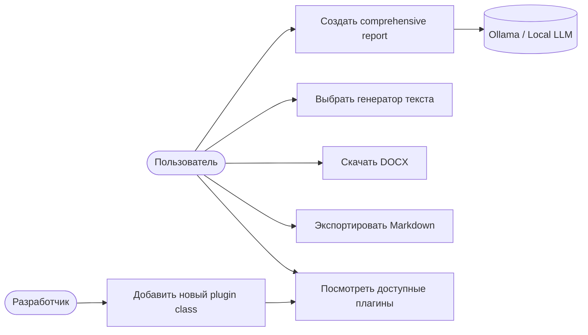

# Диаграммы взаимодействия

Документ описывает, как пользовательские действия проходят через frontend, backend, use cases, сервисы и плагины.  
Диаграммы приведены к одному стилю: сценарии начинаются от пользователя или разработчика и заканчиваются понятным результатом.

> В sequence-диаграммах используется настройка `mirrorActors: false`, чтобы Mermaid не дублировал участников снизу. `hide footbox` не используется, потому что в некоторых рендерах Mermaid он ломает диаграмму.

---

## 1. Компонентная диаграмма

### Что происходит на диаграмме

Диаграмма показывает общую архитектуру проекта. Пользователь работает с React-интерфейсом, frontend вызывает API backend-а, backend через контейнер получает use case, use case обращается к `ReportService`, а сервис выбирает нужный генератор или экспортёр через `PluginRegistry`.

### Что означает каждый прямоугольник

| Элемент | За что отвечает |
|---|---|
| `Пользователь` | Заполняет данные отчёта, запускает генерацию и скачивает результат. |
| `ReportForm / ReportPreview` | UI-компоненты React: форма ввода данных и экран предпросмотра готового отчёта. |
| `frontend reportUseCases` | Frontend-слой сценариев. Подготавливает данные формы и вызывает API-функции. |
| `reportApi.ts` | API-клиент frontend-а. Отправляет HTTP-запросы на backend: `/generate`, `/generate-docx`, `/export/{name}`, `/plugins`. |
| `presentation/api.py` | FastAPI-роутер. Принимает HTTP-запросы, валидирует DTO и возвращает JSON или файл. |
| `ApplicationContainer` | Контейнер зависимостей. Создаёт и переиспользует `PluginRegistry`, `ReportService` и use cases. |
| `GenerateReportUseCase / ExportReportUseCase` | Сценарии приложения: генерация текста отчёта и экспорт готового отчёта в файл. |
| `ReportService` | Главный сервис бизнес-логики. Строит промпт, выбирает плагин и запускает генерацию или экспорт. |
| `ReportPromptBuilder` | Формирует текст промпта из локальных данных пользователя. |
| `PluginRegistry` | Реестр плагинов. Хранит доступные генераторы и экспортёры и возвращает нужный объект по имени. |
| `StaticGenerator` | Тестовый генератор, который возвращает заранее заданный отчёт без Ollama. |
| `MockGenerator` | Заглушка для демонстрации и unit-тестов. |
| `OllamaGenerator` | Плагин, который вызывает локальную LLM через Ollama. |
| `HuggingFaceGenerator` | Опциональный плагин генерации через HuggingFace-модель. |
| `DocxExporter` | Плагин экспорта отчёта в `.docx`. |
| `MarkdownExporter` | Плагин экспорта отчёта в `.md`. |
| `Local open-source LLM` | Локальная языковая модель, которую запускает Ollama. |

### Если кратко:

Эта диаграмма показывает не один конкретный запрос, а общую структуру системы. Главное здесь — backend не привязан напрямую к одной LLM или одному формату файла. Все генераторы и экспортёры подключаются как плагины через общий реестр.

---

## 2. Последовательность генерации отчёта

### Что происходит на диаграмме

Пользователь заполняет форму отчёта. Frontend преобразует данные формы в payload и отправляет запрос `POST /generate`. Backend получает `ReportRequest`, создаёт use case через контейнер, строит промпт, выбирает генератор через реестр плагинов и возвращает готовый текст отчёта в frontend.

### Что означает каждый прямоугольник

| Элемент | За что отвечает |
|---|---|
| `Пользователь` | Вводит цель, ход работы, вывод, тон отчёта и запускает генерацию. |
| `React ReportForm` | Форма на frontend-е. Собирает локальные данные пользователя. |
| `frontend use case` | Функция `generateComprehensiveReport`. Преобразует данные формы в формат запроса backend-а. |
| `reportApi.ts` | Отправляет `fetch`-запрос на `/generate` и обрабатывает ответ или ошибку. |
| `FastAPI /generate` | Endpoint backend-а, который принимает `ReportRequest`. |
| `ApplicationContainer` | Выдаёт готовый объект `GenerateReportUseCase`. |
| `GenerateReportUseCase` | Описывает сценарий генерации отчёта на уровне приложения. Сам не генерирует текст, а вызывает `ReportService`. |
| `ReportService` | Координирует процесс: строит промпт, выбирает генератор, получает текст и возвращает `GeneratedReport`. |
| `ReportPromptBuilder` | Собирает промпт для LLM из полей `goal`, `process`, `results`, `conclusion`, `tone`. |
| `PluginRegistry` | Возвращает генератор по имени. Имя может прийти из запроса или из переменной окружения `TEXT_GENERATOR`. |
| `AbstractTextGenerator plugin` | Общий интерфейс выбранного генератора. Это может быть `ollama`, `static`, `mock` или `huggingface`. |

### Если кратко:

Эта диаграмма показывает полный пользовательский сценарий генерации. Область сценария начинается с действия пользователя и заканчивается тем, что пользователь видит готовый отчёт. Внутри backend-а используется разделение ответственности: API принимает запрос, use case запускает сценарий, сервис выполняет бизнес-логику, а плагин отвечает только за генерацию текста.

---

## 3. Последовательность генерации через Ollama

### Что происходит на диаграмме

Это частный случай генерации, когда выбран генератор `ollama`. `ReportService` просит `PluginRegistry` вернуть `OllamaGenerator`. Затем `OllamaGenerator` запускает внешнюю команду Ollama через `subprocess`, передаёт промпт в локальную модель и получает текст ответа.

### Что означает каждый прямоугольник

| Элемент | За что отвечает |
|---|---|
| `Пользователь` | Нажимает кнопку генерации отчёта. |
| `React ReportForm` | Отправляет данные на backend через frontend-логику. |
| `FastAPI /generate` | Принимает запрос на генерацию и передаёт payload дальше в приложение. |
| `ReportService` | Выбирает генератор, передаёт ему промпт и оформляет результат как `GeneratedReport`. |
| `PluginRegistry` | Находит зарегистрированный плагин с именем `ollama`. |
| `OllamaGenerator` | Адаптер между Python backend-ом и локальной Ollama. Его задача — вызвать модель и вернуть текст. |
| `subprocess` | Механизм Python для запуска внешней программы. Здесь он запускает команду `ollama run <model>`, передаёт промпт через `stdin` и получает `stdout`, `stderr`, `returncode`. |
| `Ollama CLI + local LLM` | Локальная Ollama и установленная open-source модель, например `llama3`. Именно здесь происходит генерация текста. |

### Если кратко:

`subprocess` нужен потому, что Ollama запускается как отдельная внешняя программа, а не как обычная Python-функция. Backend через `OllamaGenerator` передаёт промпт в Ollama, получает ответ модели и возвращает его пользователю. `OllamaGenerator` изолирует эту техническую деталь, поэтому остальной backend не зависит от команды `ollama run`.

---

## 4. Альтернативный сценарий: Ollama недоступна

Решение для разработки: запустить backend с `TEXT_GENERATOR=static` или передать в теле `/generate` поле `"generator": "static"`.

### Что происходит на диаграмме

Это альтернативный поток генерации, когда выбран `OllamaGenerator`, но Ollama не установлена, не добавлена в `PATH`, не запущена или недоступна. Генератор выбрасывает ошибку, backend преобразует её в HTTP-ошибку, а frontend показывает пользователю сообщение.

### Что означает каждый прямоугольник

| Элемент | За что отвечает |
|---|---|
| `Пользователь` | Пытается сгенерировать отчёт обычным способом. |
| `React ReportForm` | Отправляет запрос на генерацию и получает ошибку. |
| `FastAPI /generate` | Принимает запрос, но при ошибке генератора возвращает HTTP 502. |
| `ReportService` | Запускает генерацию и получает исключение от генератора. |
| `OllamaGenerator` | Пытается вызвать Ollama. Если исполняемый файл не найден, возвращает ошибку `RuntimeError`. |

### Если кратко:

Диаграмма нужна, чтобы показать обработку ошибки внешней зависимости. Ошибка не ломает всю архитектуру: backend возвращает понятный статус, а для разработки можно переключиться на `TEXT_GENERATOR=static`, чтобы проверять систему без локальной LLM.

---

## 5. Последовательность экспорта DOCX

### Что происходит на диаграмме

Пользователь находится на экране предпросмотра отчёта и нажимает кнопку скачивания. Frontend отправляет данные титульного листа и текст отчёта на `/generate-docx`. Backend получает `DocxRequest`, выбирает `DocxExporter`, создаёт файл и возвращает его как поток байтов.

### Что означает каждый прямоугольник

| Элемент | За что отвечает |
|---|---|
| `Пользователь` | Нажимает кнопку скачивания отчёта. |
| `React ReportPreview` | Экран предпросмотра отчёта. Даёт пользователю скачать готовый результат. |
| `reportApi.ts` | Отправляет запрос на `/generate-docx` и получает `Blob`. |
| `FastAPI /generate-docx` | Совместимый endpoint для экспорта именно в DOCX. |
| `ApplicationContainer` | Выдаёт use case `GenerateDocxUseCase`. |
| `GenerateDocxUseCase` | Специальный сценарий экспорта в DOCX. Наследуется от общего сценария экспорта. |
| `ReportService` | Запрашивает нужный экспортёр и передаёт ему payload. |
| `PluginRegistry` | Возвращает экспортёр с именем `docx`. |
| `DocxExporter` | Создаёт Word-документ: титульные данные, основной текст отчёта, форматирование и байты файла. |
| `ExportedDocument` | DTO с содержимым файла, именем файла, MIME-типом и расширением. |
| `StreamingResponse .docx` | Ответ FastAPI, который отдаёт файл браузеру как скачивание. |
| `Blob` | Объект файла на стороне браузера, из которого frontend создаёт ссылку для скачивания. |

### Если кратко:

DOCX-экспорт вынесен в отдельный плагин. Поэтому `ReportService` не знает, как именно создаётся Word-файл. Он только выбирает экспортёр `docx` и вызывает общий метод `export`.

---

## 6. Последовательность экспорта Markdown

### Что происходит на диаграмме

Это общий механизм экспорта через endpoint `/export/{exporter_name}`. В примере выбран `markdown`, поэтому backend берёт `MarkdownExporter` из реестра и формирует `.md` файл.

### Что означает каждый прямоугольник

| Элемент | За что отвечает |
|---|---|
| `Пользователь` | Выбирает экспорт отчёта в Markdown. |
| `Frontend / API client` | Клиент, который отправляет запрос на общий endpoint экспорта. Это может быть frontend или внешний API-клиент. |
| `FastAPI /export/markdown` | Endpoint для экспорта через выбранный экспортёр. В URL указано имя экспортёра `markdown`. |
| `ExportReportUseCase` | Общий сценарий экспорта в любой поддерживаемый формат. |
| `ReportService` | Передаёт payload нужному экспортёру и получает готовый документ. |
| `PluginRegistry` | Ищет экспортёр по имени `markdown`. |
| `MarkdownExporter` | Создаёт текстовый `.md` файл из данных отчёта. |
| `ExportedDocument .md` | Результат экспорта с байтами Markdown-файла. |
| `StreamingResponse .md` | Ответ backend-а, который позволяет скачать Markdown-файл. |

### Если кратко:

Эта диаграмма показывает преимущество плагинной архитектуры. Для DOCX есть отдельный совместимый endpoint `/generate-docx`, а для новых форматов есть универсальный `/export/{exporter_name}`. Чтобы добавить новый формат, не нужно переписывать бизнес-логику.

---

## 7. Добавление нового плагина

### Что происходит на диаграмме

Диаграмма показывает не действие обычного пользователя, а действие разработчика. Разработчик добавляет новый класс-плагин, реализует общий интерфейс и регистрирует его в контейнере. После этого плагин появляется в списке `/plugins` и может быть выбран клиентом по имени.

### Что означает каждый прямоугольник

| Элемент | За что отвечает |
|---|---|
| `Разработчик` | Добавляет новый генератор или экспортёр в проект. |
| `Создать новый класс` | Новый файл в `backend/plugins/generators/` или `backend/plugins/exporters/`. |
| `AbstractTextGenerator` | Базовый интерфейс для генераторов текста. Требует `name` и `generate(prompt)`. |
| `AbstractExporter` | Базовый интерфейс для экспортёров документов. Требует `name`, `file_extension`, `media_type`, `export(payload)`. |
| `name` | Уникальное имя плагина, по которому его можно выбрать. |
| `generate/export` | Главный метод плагина: генератор создаёт текст, экспортёр создаёт файл. |
| `ApplicationContainer.plugin_registry` | Место, где плагин регистрируется в общем реестре. |
| `/plugins` | Endpoint, который показывает доступные генераторы и экспортёры. |
| `Клиент может выбрать его по имени` | Frontend или API-клиент может использовать имя плагина в запросе. |

### Если кратко:

Это показывает принцип Open/Closed: чтобы расширить систему, мы добавляем новый класс, а не переписываем старые use case-ы и сервисы.

---

## 8. Use case diagram

### Что происходит на диаграмме

Диаграмма показывает основные сценарии использования системы. Пользователь создаёт отчёт, выбирает генератор, скачивает файл и смотрит список плагинов. Разработчик расширяет систему, добавляя новый plugin class.

### Что означает каждый прямоугольник

| Элемент | За что отвечает |
|---|---|
| `Пользователь` | Основной актор системы: создаёт и скачивает отчёты. |
| `Разработчик` | Технический актор: расширяет систему новыми плагинами. |
| `Ollama / Local LLM` | Внешняя зависимость для сценария генерации текста. |
| `Создать comprehensive report` | Основной сценарий генерации подробного отчёта. |
| `Выбрать генератор текста` | Возможность использовать `ollama`, `static`, `mock` или `huggingface`. |
| `Скачать DOCX` | Сценарий получения отчёта в формате Word. |
| `Экспортировать Markdown` | Сценарий получения отчёта в формате `.md`. |
| `Посмотреть доступные плагины` | Сценарий вызова `/plugins`, чтобы увидеть доступные реализации. |
| `Добавить новый plugin class` | Расширение системы новым генератором или экспортёром. |

### Если кратко:

Эта диаграмма показывает систему с точки зрения ролей. Пользователь работает с готовыми возможностями, а разработчик расширяет архитектуру через плагины.
