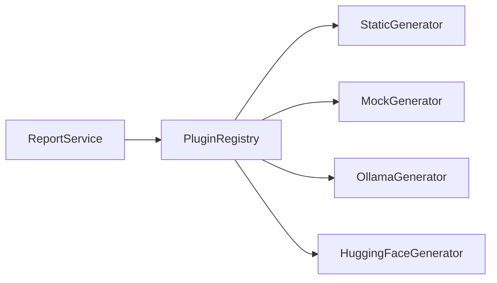
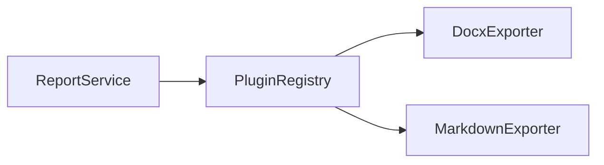

# Поддерживаемость и заменяемость

После доработки по ipynb проект стал не просто слоистым, а плагинным. Это улучшает поддерживаемость, потому что новые генераторы и экспортёры добавляются отдельными классами, а не переписыванием существующих use case-ов.

## До

- генератор текста подключался как конкретный адаптер;
- экспорт DOCX был отдельной инфраструктурной реализацией;
- для добавления нового формата требовалось менять API/use case;
- не было единого списка доступных генераторов и экспортёров.

## После

- генераторы реализуют `AbstractTextGenerator`;
- экспортёры реализуют `AbstractExporter`;
- `PluginRegistry` хранит все доступные плагины;
- `ReportService` выбирает нужный плагин по имени;
- `ApplicationContainer` создаёт и внедряет зависимости;
- через `/plugins` можно увидеть доступные реализации.

---

## 1. Заменяемость генератора



### Что показывает диаграмма

Диаграмма показывает, что `ReportService` не выбирает конкретный класс напрямую. Он обращается к `PluginRegistry`, а уже реестр возвращает нужный генератор по имени.

### Что означает каждый прямоугольник

| Элемент | За что отвечает |
|---|---|
| `ReportService` | Запускает генерацию отчёта и просит реестр выдать нужный генератор. |
| `PluginRegistry` | Хранит зарегистрированные генераторы и возвращает нужный по имени. |
| `StaticGenerator` | Тестовый генератор без Ollama. Удобен для проверки backend-а. |
| `MockGenerator` | Заглушка для unit-тестов и демонстрации. |
| `OllamaGenerator` | Основной production-вариант генерации через локальную Ollama. |
| `HuggingFaceGenerator` | Альтернативный вариант генерации через HuggingFace. |

### Как выбрать генератор

По умолчанию генератор задаётся через `.env`:

```env
TEXT_GENERATOR=ollama
OLLAMA_MODEL=llama3
```

Для проверки без Ollama:

```env
TEXT_GENERATOR=static
```

Также генератор можно выбрать в теле запроса:

```json
{
  "goal": "...",
  "process": "...",
  "conclusion": "...",
  "generator": "mock"
}
```

### Как объяснить преподавателю

Можно сказать так:

> Если нужно заменить LLM, мы не меняем `ReportService`. Мы добавляем или выбираем другой генератор в `PluginRegistry`. Это снижает связанность и делает проект легче поддерживать.

---

## 2. Заменяемость экспортёра



### Что показывает диаграмма

Диаграмма показывает, что экспорт документов тоже сделан через плагины. `ReportService` не знает, как именно создаётся DOCX или Markdown. Он только выбирает экспортёр по имени и вызывает общий метод `export`.

### Что означает каждый прямоугольник

| Элемент | За что отвечает |
|---|---|
| `ReportService` | Запускает экспорт отчёта и передаёт данные выбранному экспортёру. |
| `PluginRegistry` | Хранит экспортёры и возвращает нужный по имени. |
| `DocxExporter` | Создаёт `.docx` файл через библиотеку `python-docx`. |
| `MarkdownExporter` | Создаёт `.md` файл как текстовый документ. |

### Как выбрать экспортёр

DOCX остаётся основным форматом:

```http
POST /generate-docx
```

Новые форматы доступны через общий endpoint:

```http
POST /export/markdown
```

### Как объяснить преподавателю

Можно сказать так:

> Раньше DOCX был единственным форматом, а теперь экспортёр выбирается как плагин. Если нужен PDF, HTML или TXT, можно добавить новый класс-экспортёр и зарегистрировать его, не меняя `ReportService`.

---

## 3. Почему поддерживать стало проще

| Ситуация | Что делать теперь |
|---|---|
| Нужна новая LLM | Создать новый класс-плагин генератора. |
| Нужен новый формат файла | Создать новый класс-плагин экспортёра. |
| Нужно тестировать без Ollama | Выбрать `static` или `mock`. |
| Нужно показать список возможностей frontend | Вызвать `/plugins`. |
| Нужно изменить способ сборки зависимостей | Править только `ApplicationContainer`. |
| Нужно поменять дефолтный генератор | Изменить `TEXT_GENERATOR` в `.env`. |
| Нужно поменять модель Ollama | Изменить `OLLAMA_MODEL` в `.env`. |

## 4. Принцип Open/Closed

Код стал ближе к принципу Open/Closed:

- **открыт для расширения** — можно добавлять новые классы-плагины;
- **закрыт для постоянного изменения** — не нужно переписывать старые use case-ы и сервисы при добавлении новых форматов или генераторов.

## 5. Если коротко:

Можно сказать так:

> Поддерживаемость улучшилась за счёт того, что система стала плагинной. `ReportService` работает через абстрактные интерфейсы, `PluginRegistry` хранит реализации, а `ApplicationContainer` собирает зависимости. Поэтому новый генератор или экспортёр добавляется отдельным классом, а не изменением всей архитектуры.
