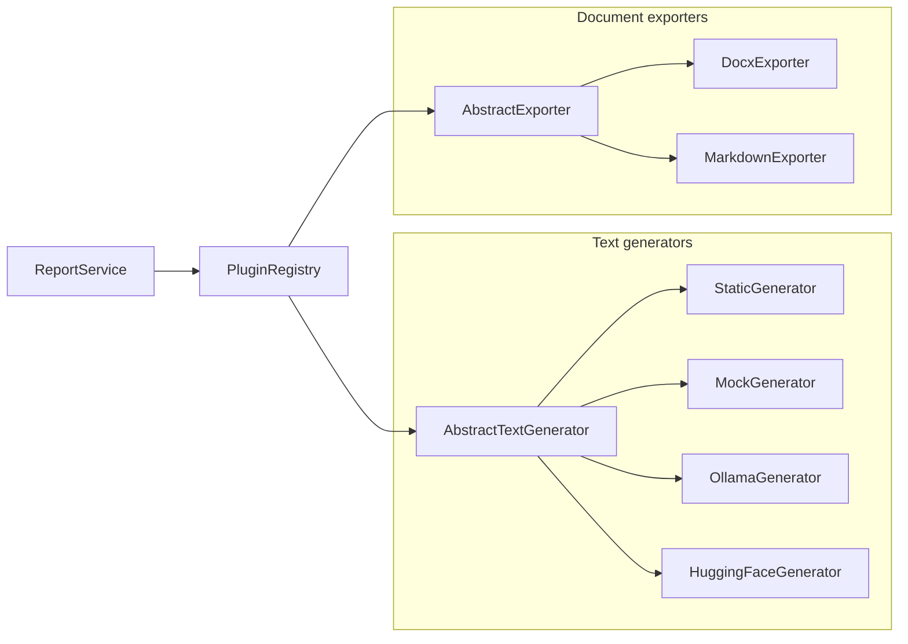

# Реализация по ipynb: многоклассовость, плагины и зависимости

Этот документ фиксирует доработку проекта ILoveReports по отчёту `ProjectPracticum_MultiClass_Plugins.ipynb`.

## Цель

Исходная архитектура уже была разделена на слои, но генераторы и экспортёры оставались скорее адаптерами. После доработки они оформлены как полноценные плагины с общими абстрактными классами, реестром и сервисом-оркестратором.

## Что добавлено

```text
backend/
  plugins/
    base.py                         # AbstractTextGenerator, AbstractExporter, ExportedDocument
    generators/
      static.py                     # StaticGenerator, MockGenerator
      ollama.py                     # OllamaGenerator
      huggingface.py                # HuggingFaceGenerator
    exporters/V
      docx.py                       # DocxExporter
      markdown.py                   # MarkdownExporter
  application/
    plugin_registry.py              # PluginRegistry
    report_service.py               # ReportService
    dependencies.py                 # ApplicationContainer + ApplicationSettings
    prompt_builder.py               # ReportPromptBuilder
    use_cases.py                    # GenerateReportUseCase, ExportReportUseCase, GenerateDocxUseCase
```

## Главная идея

`ReportService` не знает, какой генератор реально используется. Он получает имя плагина, берёт объект из `PluginRegistry` и вызывает общий метод `generate()`.

То же самое сделано для экспорта: `docx` и `markdown` имеют общий интерфейс `AbstractExporter`, поэтому новый формат можно добавить отдельным классом.

## 1. Архитектура плагинов



### Что показывает диаграмма

Диаграмма показывает, что `ReportService` работает не с конкретными классами, а с реестром плагинов. Реестр содержит две группы: генераторы текста и экспортёры документов.

### Что означает каждый прямоугольник

| Элемент | За что отвечает |
|---|---|
| `ReportService` | Главный сервис, который запускает генерацию или экспорт. |
| `PluginRegistry` | Хранит плагины и отдаёт нужный по имени. |
| `AbstractTextGenerator` | Общий интерфейс для генераторов. |
| `StaticGenerator` | Тестовый генератор без внешних зависимостей. |
| `MockGenerator` | Заглушка для тестов и демонстрации. |
| `OllamaGenerator` | Генератор через локальную Ollama. |
| `HuggingFaceGenerator` | Опциональный генератор через HuggingFace. |
| `AbstractExporter` | Общий интерфейс для экспортёров. |
| `DocxExporter` | Экспорт в `.docx`. |
| `MarkdownExporter` | Экспорт в `.md`. |

## 2. Реализованные плагины

### Генераторы

| Плагин | Класс | Назначение |
|---|---|---|
| `ollama` | `OllamaGenerator` | Генерация через локальный Ollama и open-source LLM. |
| `static` | `StaticGenerator` | Детерминированный тестовый режим без Ollama. |
| `mock` | `MockGenerator` | Заглушка для unit-тестов и демонстрации. |
| `huggingface` | `HuggingFaceGenerator` | Опциональная генерация через HuggingFace-модель. |

### Экспортёры

| Плагин | Класс | Формат |
|---|---|---|
| `docx` | `DocxExporter` | `.docx`. |
| `markdown` | `MarkdownExporter` | `.md`. |

## 3. Новые API

| Метод | URL | Назначение |
|---|---|---|
| `GET` | `/plugins` | Показать доступные генераторы и экспортёры. |
| `POST` | `/generate` | Сгенерировать отчёт через выбранный генератор. |
| `POST` | `/generate-docx` | Совместимый endpoint для DOCX. |
| `POST` | `/export/{exporter_name}` | Экспортировать отчёт через выбранный экспортёр. |

## 4. Пример выбора генератора

```json
{
  "goal": "Изучить архитектуру приложения",
  "process": "Были выделены плагины, реестр и сервис",
  "results": "Код стал расширяемым",
  "conclusion": "Цель достигнута",
  "generator": "static"
}
```

Если `generator` не передан, используется переменная окружения:

```env
TEXT_GENERATOR=ollama
```

## 5. Пример выбора экспортёра

```http
POST /export/markdown
```

Тело запроса такое же, как у `/generate-docx`.

## 6. Использованные паттерны

| Паттерн | Где используется | Зачем нужен |
|---|---|---|
| Strategy | `AbstractTextGenerator`, `AbstractExporter` | Позволяет взаимозаменять реализации. |
| Registry | `PluginRegistry` | Хранит плагины и отдаёт их по имени. |
| Dependency Injection | `ApplicationContainer` | Создаёт зависимости в одном месте и передаёт их в сервисы/use cases. |
| Service | `ReportService` | Содержит бизнес-логику генерации и экспорта. |
| DTO | `ReportRequest`, `DocxRequest`, `GeneratedReport`, `ExportedDocument` | Передают данные между слоями без привязки к UI или инфраструктуре. |

## 7. Как добавить новый генератор

1. Создать класс в `backend/plugins/generators/`.
2. Унаследоваться от `AbstractTextGenerator`.
3. Реализовать свойства `name`, `description` и метод `generate(prompt: str) -> str`.
4. Зарегистрировать класс в `ApplicationContainer.plugin_registry()`.

Пример:

```python
class MyGenerator(AbstractTextGenerator):
    @property
    def name(self) -> str:
        return "my_generator"

    @property
    def description(self) -> str:
        return "My custom generator"

    def generate(self, prompt: str) -> str:
        return "generated text"
```

После регистрации плагин появится в `/plugins`, и его можно будет выбрать по имени `my_generator`.

## 8. Как добавить новый экспортёр

1. Создать класс в `backend/plugins/exporters/`.
2. Унаследоваться от `AbstractExporter`.
3. Реализовать `name`, `file_extension`, `media_type`, `export()`.
4. Зарегистрировать класс в `ApplicationContainer.plugin_registry()`.

Пример:

```python
class PdfExporter(AbstractExporter):
    @property
    def name(self) -> str:
        return "pdf"

    @property
    def file_extension(self) -> str:
        return ".pdf"

    @property
    def media_type(self) -> str:
        return "application/pdf"

    def export(self, payload: DocxRequest) -> ExportedDocument:
        ...
```

После регистрации можно будет вызвать:

```http
POST /export/pdf
```

## 9. Если коротко:

Можно сказать так:

> Раньше генерация и экспорт были привязаны к конкретным реализациям. После доработки система стала плагинной. Генераторы и экспортёры реализуют общие интерфейсы, регистрируются в `PluginRegistry`, а `ReportService` выбирает нужный плагин по имени. Это снижает связанность и позволяет расширять проект без переписывания основной логики.
